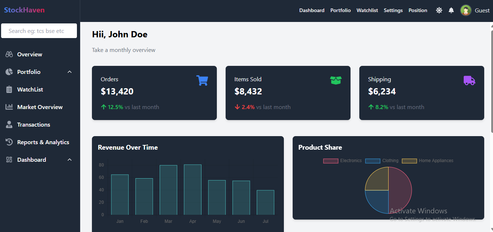

# Task_manager_app

# Taskify

## 🚀 Features

- 📊 Real-time stock market data
- 🌓 Dark/Light mode support
- 📱 Responsive design
- 🔐 User authentication
- 📈 Portfolio tracking
- 🔍 Task search functionality
- 📋 Watchlist management

## 💻 Tech Stack

- Frontend:
  - React.js
  - Redux Toolkit
  - Tailwind CSS
  - React Router
  - React Icons
  - lucid Icons

- Backend:
  - Node.js
  - Express.js
  - MongoDB
  - JWT Authentication

## 📸 Screenshots

### LandingPage

### Dashboard Page

### Mobile Responsive

## 🛠️ Installation Steps

1. Clone the repository